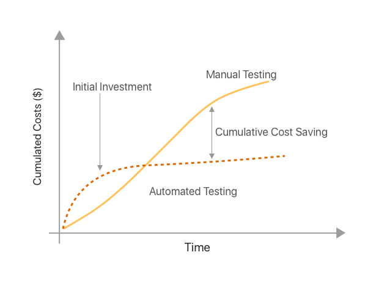

# Formation "Tester pour devenir un bon développeur" (WIP)

## Les qualités d'une application

- Conformité aec les attentes des utilisateurs
- UI intuitive, UX fluide, Accessibilité
- Performance, Optimisation des ressources
- Fiabilité
- Sécurité   
  ...
- **Une application qui fonctionne en rythme courant sans l'informatique**
- **Une application avec un coût de MCO/MCS faible**

## Constats

Constat 1 : un temps important des développeurs est alloué au suivi de production, et dans une moindre mesure à la correction de bugs

- penser le fonctionnement de l'application pour que les utilisateurs soient autonomes et libérer du temps au développeur pour vraiment faire leur métier

Constat 2 : les montées de version des composants utilisés dans le SI sont souvent péniblement (voir pas) mis à jour

- mettre en place une stratégie pour palier ce problème

## Pourquoi tester ? (1)

> écrire des tests, c'est inutile, la MOA fait une recette
> en plus, ça prend beaucoup de temps

## Pourquoi tester ? (2)

- améliorer la productivité future du SI

## Pourquoi tester ? (3)

- un bon informaticien a horreur de faire plusieurs fois la même chose : automatisation des tâches répétitives => tests automatiques plutôt que des tests manuels
- ne plus avoir peur de faire des régressions lors de refactors ou d'évolutions dans la base de code
- faciliter les montées de version des bibliothèques utilisées dans le SI (si les tests passent, pas besoin de tests manuels, ou de manière réduite et ciblé)

## Stratégie de tests

- **tester le comportement**  : tester le comportement permet de vérifier que le service fonctionne correctement, indépendamment de son code interne, ce qui rend les tests plus durables
